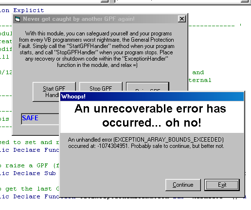



## GPF Exception Handler

### Description

Tired of your favourite VB program crashing because of General Protection Faults? Bad subclassing code? Well... if any unhandled exceptions occur, your program will be able to cope, and even continue running. Please leave a line or two to let me know if this has been useful. Thanks.

10/12/02 - Updated: Now the module top level exception handler will raise the error via Err.Raise to allow VB to handle the error using On Error statements. GPFs can now be caught, just the same as any other error :) Thanks to those below who suggested this.

Also, I added some more constants, to allow deriving of more information from the EXCEPTION_RECORD structure. This means more info for your user, which is always good.
 
### More Info
 
Note that this won't catch normal VB errors, since these are handled by the VB runtime DLL. This will protect against General Protection Faults, which would ordinarily bring your application to it's knees.

             |
---                |---
**Submitted On**   |2002-12-10 07:07:04
**By**             |[Will Barden](https://github.com/Planet-Source-Code/PSCIndex/blob/master/ByAuthor/will-barden.md)
**Level**          |Intermediate
**User Rating**    |5.0 (99 globes from 20 users)
**Compatibility**  |VB 5\.0, VB 6\.0
**Category**       |[Debugging and Error Handling](https://github.com/Planet-Source-Code/PSCIndex/blob/master/ByCategory/debugging-and-error-handling__1-26.md)
**World**          |[Visual Basic](https://github.com/Planet-Source-Code/PSCIndex/blob/master/ByWorld/visual-basic.md)
**Archive File**   |[GPF\_Except15109312102002\.zip](https://github.com/Planet-Source-Code/will-barden-gpf-exception-handler__1-41421/archive/master.zip)

